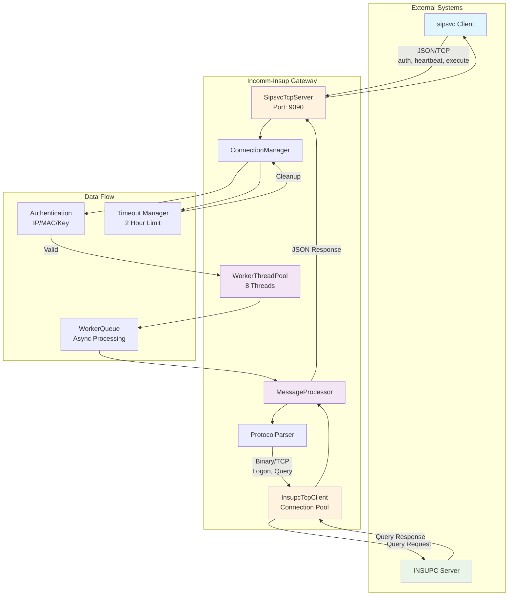
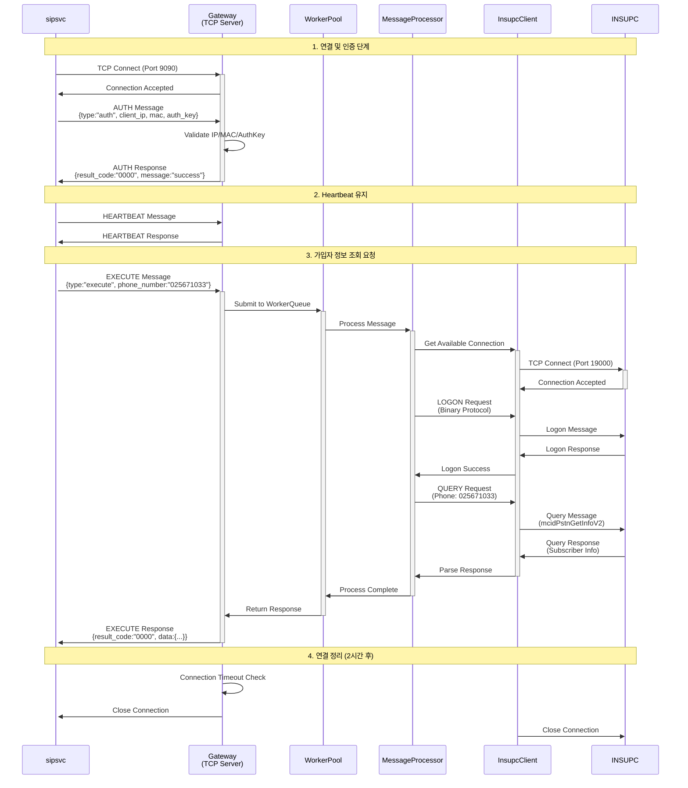
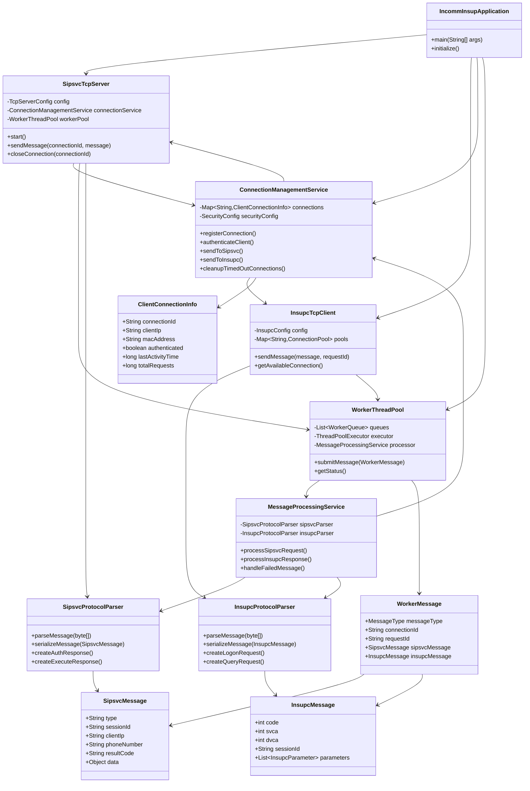

# Incomm-Insup Gateway Server

[](https://openjdk.java.net/projects/jdk/21/)
[](https://spring.io/projects/spring-boot)
[](https://netty.io/)
[](LICENSE)

> sipsvc와 INSUPC 사이의 Gateway 역할을 하는 TCP 서버 애플리케이션

## 📋 개요

**Incomm-Insup**은 전화 호가 인입될 때 sipsvc 프로세스와 INSUPC(가입자 정보 조회) 프로세스 간의 통신을 중계하는 Gateway 서버입니다.

### 🔄 C++ 기존 구현과의 호환성

이 Java 구현체는 기존 C++ 구현체(`inas_ext_gw_plugin`)와 **프로토콜 레벨에서 완전히 호환**됩니다:

- **INSUPC 프로토콜**: C++ `struct _t_insup_message_header` (62바이트 고정 헤더)와 동일한 구조
- **메시지 코드**: C++ `enum e_insup_header_msg_code`와 동일한 상수 (`DB_QUERY_REQUEST=1`, `DB_QUERY_RESPONSE=2` 등)
- **파라미터 타입**: C++ `enum e_insup_body_parameter_type`과 동일한 구조 (`DB_OPERATION_NAME=2`, `SQL_INPUT=3` 등)
- **바이트 순서**: Little Endian 처리, 필드 크기 정확히 일치
- **프로토콜 함수**: C++ 구현 (`generate_insup_db_operation_name_parameter`, `parse_sql_output_response_parameter` 등)과 동일한 로직

### 주요 기능

- 🔄 **TCP 통신 중계**: sipsvc(JSON/TCP) ↔ INSUPC(Binary/TCP)
- 🔐 **인증 및 보안**: IP/MAC/인증키 기반 클라이언트 검증
- ⚡ **비동기 처리**: WorkerThread Pool을 통한 고성능 메시지 처리
- 📊 **연결 관리**: 다중 클라이언트 연결 및 2시간 타임아웃 관리
- 📝 **로깅**: 날짜별 100MB rolling 로그 (Logback)

## 🏗️ 아키텍처

### 시스템 워크플로우



### 시퀀스 다이어그램



### 통신 플로우

1. **sipsvc** → JSON 메시지 전송 (auth, heartbeat, execute)
2. **Gateway** → 메시지를 WorkerThread Queue에 분배
3. **WorkerThread** → INSUPC 프로토콜로 변환 후 질의
4. **INSUPC** → 응답 데이터 반환
5. **Gateway** → JSON 형태로 변환하여 sipsvc에 응답

## 🚀 빠른 시작

### 필수 요구사항

- **Java 21** 이상
- **Maven 3.8** 이상
- **Linux** 운영체제 (Ubuntu, CentOS, RHEL 등)

### 프로젝트 클론

```bash
git clone https://github.com/hak023/incomm-insup.git
cd incomm-insup
```

### 빌드 및 실행

```bash
# 프로젝트 빌드
./build.sh

# 애플리케이션 시작
./start.sh

# 애플리케이션 정지
./stop.sh
```

### Docker 실행

```bash
# Docker Compose로 실행
docker-compose up -d

# 로그 확인
docker-compose logs -f incomm-insup

# 정지
docker-compose down
```

## ⚙️ 설정

### 환경 설정

프로파일 기반 설정을 사용합니다:

- `application.yaml` - 기본 설정 및 프로파일 지정
- `application-test.yaml` - 테스트 환경 설정
- `application-prod.yaml` - 운영 환경 설정

### 주요 설정 항목

#### TCP 서버 설정 (sipsvc와의 통신)

```yaml
tcp:
  server:
    port: 9090
    boss-threads: 1
    worker-threads: 4
    connection-timeout: 7200000  # 2시간
    max-connections: 100
```

#### INSUPC 클라이언트 설정

```yaml
insupc:
  clients:
    - name: "INSUPC-1"
      host: "127.0.0.1"
      port: 19000
      connection-pool-size: 5
      connection-timeout: 30000
      read-timeout: 10000
```

#### 보안 설정

```yaml
security:
  allowed-clients:
    - ip: "192.168.1.100"
      mac: "00:11:22:33:44:55"
      auth-key: "PROD_AUTH_KEY_001"
      description: "Production sipsvc 1"
```

## 📡 API 인터페이스

### sipsvc → Gateway (JSON/TCP)

#### 인증 메시지
```json
{
  "type": "auth",
  "session_id": "session123",
  "client_ip": "192.168.1.100",
  "mac_address": "00:11:22:33:44:55",
  "auth_key": "PROD_AUTH_KEY_001"
}
```

#### Execute 메시지 (가입자 정보 조회)
```json
{
  "type": "execute",
  "request_id": "req123",
  "session_id": "session123",
  "phone_number": "025671033",
  "service_code": "mcidPstnGetInfoV2"
}
```

### Gateway → INSUPC (Binary/TCP)

INSUPC 프로토콜을 따르는 바이너리 메시지:

- **Logon Request**: INSUPC 연결 인증
- **Query Request**: 가입자 정보 질의
- **Query Response**: 질의 결과 반환

## 📊 모니터링

### Health Check

```bash
# 애플리케이션 상태 확인
curl http://localhost:8080/api/actuator/health

# 연결 상태 확인
curl http://localhost:8080/api/actuator/metrics
```

### 로그 파일

- `logs/incomm-insup.log` - 전체 애플리케이션 로그
- `logs/incomm-insup_tcp.log` - TCP 통신 전용 로그
- `logs/incomm-insup_worker.log` - WorkerThread 전용 로그
- `logs/incomm-insup_error.log` - 오류 로그

### 실시간 로그 모니터링

```bash
# 전체 로그
tail -f logs/incomm-insup.log

# TCP 통신 로그
tail -f logs/incomm-insup_tcp.log

# 워커 스레드 로그
tail -f logs/incomm-insup_worker.log
```

## 🧪 테스트

### 단위 테스트

```bash
mvn test
```

### 통합 테스트

테스트 시뮬레이터를 제공하여 전체 플로우를 테스트할 수 있습니다.

```bash
# 테스트 시뮬레이터 실행
java -jar test-simulator.jar
```

## 📁 프로젝트 구조

### 클래스 다이어그램



### 디렉토리 구조

```
incomm-insup/
├── src/main/java/com/in/amas/
│   ├── IncommInsupApplication.java     # 메인 애플리케이션
│   ├── config/                         # 설정 클래스
│   │   ├── ApplicationConfig.java
│   │   ├── SecurityConfig.java
│   │   ├── TcpServerConfig.java
│   │   └── InsupcConfig.java
│   ├── dto/                           # 데이터 전송 객체
│   │   ├── SipsvcMessage.java
│   │   ├── InsupcMessage.java
│   │   ├── WorkerMessage.java
│   │   └── ClientConnectionInfo.java
│   ├── protocol/                      # 프로토콜 파서
│   │   ├── SipsvcProtocolParser.java
│   │   └── InsupcProtocolParser.java
│   ├── service/                       # 비즈니스 서비스
│   │   ├── MessageProcessingService.java
│   │   └── ConnectionManagementService.java
│   ├── tcp/                          # TCP 서버/클라이언트
│   │   ├── SipsvcTcpServer.java
│   │   └── InsupcTcpClient.java
│   ├── worker/                       # 워커 스레드
│   │   ├── WorkerThreadPool.java
│   │   ├── WorkerQueue.java
│   │   └── WorkerTask.java
│   └── simulator/                    # 테스트 시뮬레이터
│       └── TestSimulator.java
├── src/main/resources/
│   ├── application.yaml
│   ├── application-test.yaml
│   └── logback-spring.xml
├── Dockerfile
├── docker-compose.yml
├── build.sh
├── start.sh
├── stop.sh
├── build-simulator.sh
├── run-simulator.sh
├── simulator-pom.xml
└── pom.xml
```

## 🔧 개발 가이드

### 환경 설정

1. **IDE 설정**: IntelliJ IDEA 또는 Eclipse 권장
2. **Lombok 플러그인** 설치 필요
3. **프로젝트 Import**: Maven 프로젝트로 import

### 코딩 규칙

- **패키지명**: `com.in.amas.*`
- **로깅**: Slf4j + Logback 사용
- **코드 스타일**: Google Java Style Guide 준수
- **주석**: JavaDoc 형식으로 작성

### 브랜치 전략

- `main`: 운영 브랜치
- `develop`: 개발 브랜치
- `feature/*`: 기능 개발 브랜치
- `hotfix/*`: 긴급 수정 브랜치

## 🚦 성능

### 처리 성능

- **동시 연결**: 최대 100개 클라이언트
- **메시지 처리**: 초당 1,000+ TPS
- **응답 시간**: 평균 50ms 이하
- **메모리 사용량**: 1GB 이하

### 최적화

- **WorkerThread Pool**: 8개 스레드 (설정 가능)
- **Connection Pool**: INSUPC당 5개 연결
- **Queue Capacity**: 1,000개 메시지
- **Netty NIO**: 비동기 I/O 처리

## 🔒 보안

### 인증 메커니즘

- **IP 화이트리스트**: 허용된 IP만 접근 가능
- **MAC 주소 검증**: 네트워크 카드 식별
- **인증키**: 클라이언트별 고유 키
- **세션 관리**: 세션 기반 연결 추적

### 보안 고려사항

- 모든 통신은 내부 네트워크에서만 허용
- 인증 실패 시 연결 즉시 차단
- 타임아웃 설정으로 유휴 연결 정리
- 로그를 통한 보안 이벤트 추적

## 📈 확장성

### 수평 확장

- **로드 밸런서**: 여러 인스턴스 배포 가능
- **무상태 설계**: 세션 정보 외부 저장소 활용
- **컨테이너화**: Docker/Kubernetes 배포

### 수직 확장

- **메모리 증설**: JVM 힙 크기 조정
- **CPU 증설**: WorkerThread 수 증가
- **네트워크**: 대역폭 확장

## 📋 운영 가이드

### 모니터링 지표

- **연결 수**: 활성/인증된 연결 수
- **메시지 처리량**: 초당 처리 메시지 수
- **응답 시간**: 평균/최대 응답 시간
- **오류율**: 실패한 메시지 비율
- **메모리/CPU 사용률**

### 장애 대응

1. **연결 장애**: 재연결 로직 자동 수행
2. **메시지 처리 실패**: 최대 3회 재시도
3. **INSUPC 장애**: 다른 INSUPC 인스턴스로 failover
4. **메모리 부족**: 큐 크기 제한 및 백프레셰 적용

## 🔧 프로토콜 상세 (C++ 호환성)

### INSUPC 메시지 헤더 구조

```c
// C++ struct _t_insup_message_header (62바이트)
struct InsupcHeader {
    uint16_t  msg_len;        // 2바이트: 바디 크기
    uint8_t   msg_code;       // 1바이트: 메시지 코드
    uint8_t   svca;           // 1바이트: Source VCA
    uint8_t   dvca;          // 1바이트: Destination VCA  
    uint8_t   inas_id;       // 1바이트: INAS ID
    char      session_id[30]; // 30바이트: 세션 ID
    char      svc_id[4];     // 4바이트: 서비스 ID
    uint8_t   result;        // 1바이트: 결과 코드
    char      wtime[17];     // 17바이트: 처리 시간
    uint8_t   major_version; // 1바이트: Major 버전
    uint8_t   minor_version; // 1바이트: Minor 버전
    uint8_t   dummy;         // 1바이트: 더미
    uint8_t   use_request_ack; // 1바이트: ACK 사용 여부
};
```

### 메시지 코드 매핑

| C++ Enum | Java Constant | 설명 |
|----------|---------------|------|
| `DB_QUERY_REQUEST = 1` | `MessageCode.DB_QUERY_REQUEST` | DB 질의 요청 |
| `DB_QUERY_RESPONSE = 2` | `MessageCode.DB_QUERY_RESPONSE` | DB 질의 응답 |
| `DB_ACCESS_REQUEST = 3` | `MessageCode.DB_ACCESS_REQUEST` | DB 접근 요청 |
| `DB_ACCESS_RESPONSE = 4` | `MessageCode.DB_ACCESS_RESPONSE` | DB 접근 응답 |

### 파라미터 타입 매핑

| C++ Enum | Java Constant | 설명 |
|----------|---------------|------|
| `DB_OPERATION_NAME = 2` | `Type.DB_OPERATION_NAME` | API 이름 |
| `SQL_INPUT = 3` | `Type.SQL_INPUT` | SQL 입력 파라미터 |
| `SQL_OUTPUT = 4` | `Type.SQL_OUTPUT` | SQL 출력 결과 |
| `SQL_RESULT = 5` | `Type.SQL_RESULT` | SQL 실행 결과 |

### 호환성 보장 요소

1. **바이트 순서**: Little Endian 일관 사용
2. **필드 크기**: C++ 구조체와 정확히 일치
3. **프로토콜 로직**: 동일한 파라미터 생성/파싱 로직
4. **메시지 플로우**: 기존 C++ 시스템과 동일한 처리 순서

## 📝 변경 이력

### v1.0.0 (2025-01-06)
- 초기 버전 릴리스
- C++ 기존 구현과 프로토콜 호환성 확보
- sipsvc-INSUPC Gateway 기본 기능 구현
- TCP 서버/클라이언트 구현
- WorkerThread Pool 및 비동기 처리
- 연결 관리 및 인증 시스템
- 로깅 및 모니터링 기능

## 🤝 기여

1. Fork the repository
2. Create your feature branch (`git checkout -b feature/amazing-feature`)
3. Commit your changes (`git commit -m 'Add some amazing feature'`)
4. Push to the branch (`git push origin feature/amazing-feature`)
5. Open a Pull Request

## 📄 라이선스

이 프로젝트는 MIT 라이선스를 따릅니다. 자세한 내용은 [LICENSE](LICENSE) 파일을 참조하세요.

## 📞 지원

- **개발팀**: InComm Development Team
- **이슈 트래킹**: [GitHub Issues](https://github.com/hak023/incomm-insup/issues)
- **문서**: [Wiki](https://github.com/hak023/incomm-insup/wiki)

---

> **Note**: 이 애플리케이션은 리눅스 환경에서 최적화되어 개발되었습니다.
> 운영 환경 배포 전 충분한 테스트를 권장합니다.